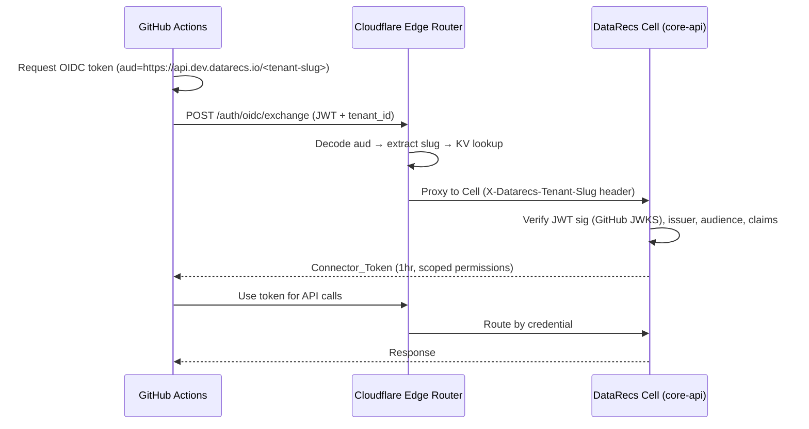

# DataRecs GitHub Actions OIDC Authentication Demo

Demonstrates keyless authentication from GitHub Actions to [DataRecs](https://datarecs.io) using OIDC federation.

No long-lived secrets required — GitHub's OIDC runtime mints a short-lived JWT and DataRecs exchanges it for a scoped access token.

## How It Works

## Workflow Jobs

The workflow demonstrates three different integration patterns:

| Job | Description |
|-----|-------------|
| `auth-and-api` | Authenticates via OIDC, then calls the DataRecs API directly with curl |
| `auth-and-cli` | Authenticates via OIDC, then uses the DataRecs CLI |
| `negative-test` | Authenticates via OIDC with `jobs:read,connections:read` and deliberately tries to access webhooks (should fail with 403) |

## Prerequisites

Configure repository variables `DATARECS_TENANT_SLUG` and `DATARECS_TENANT_ID` for a disposable
OIDC test tenant. The OIDC connector in that tenant must use:
- **Issuer:** `https://token.actions.githubusercontent.com`
- **Audience:** `https://api.dev.datarecs.io/<tenant-slug>`
- **Claim condition:** `repository` equals `datarecs/demo-github-actions-auth`
- **Permissions:** `jobs:read`, `connections:read`

## OIDC Audience Convention

The audience follows the pattern `https://<api-host>/<tenant-slug>`. The edge router parses this to route the request to the correct Cell without verifying the JWT signature — that's the Cell's job.

## Security

- No long-lived secrets stored in GitHub
- Token scoped to `jobs:read` and `connections:read` only
- Claim condition locks authentication to this specific repository
- Token lifetime: 1 hour
- The negative test requires an exact HTTP 403 from the real `webhook-endpoints` operation; setup
  errors and unrelated 4xx responses are failures, never acceptable substitutes
- Pin `datarecs/github-actions-auth` to a released tag (`@v1`) or a specific commit SHA — never
  `@main` — so a change to the action can't silently alter what this workflow does
